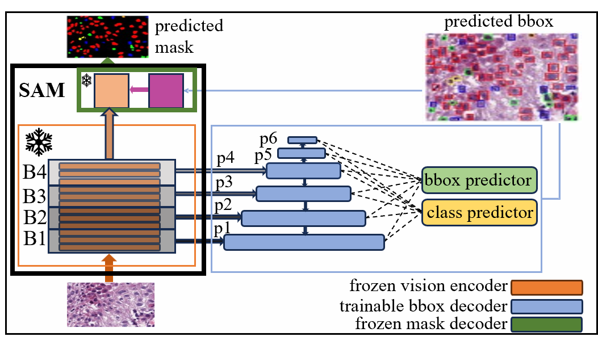
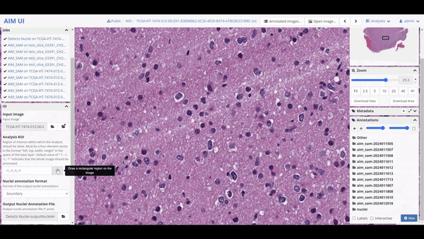
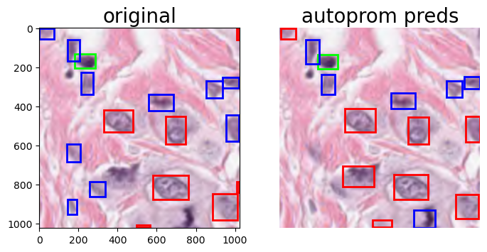
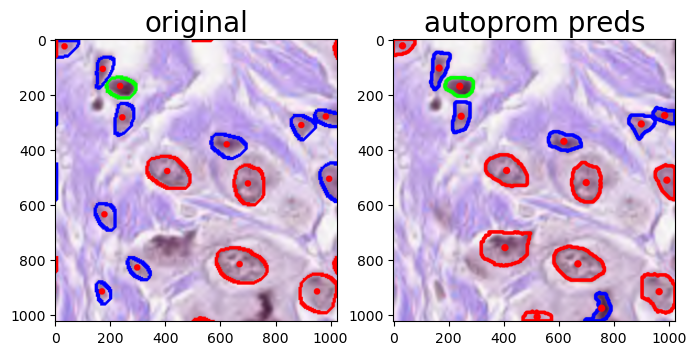

# autoprom-sam

<div align="center">
  
</div>

This repository contains the code for the paper:

**'PATHOLOGICAL PRIMITIVE SEGMENTATION BASED ON VISUAL FOUNDATION MODEL WITH ZERO-SHOT MASK GENERATION'**

**Authors:**
- Abu Bakor Hayat Arnob
- Xiangxue Wang
- Yiping Jiao
- Xiao Gan
- Wenlong Ming
- Jun Xu


# Digital Slide Archive Plugin

`autoprom-sam` can also be converted into a **Digital Slide Archive** plugin. 

Below is the demo for the modified version of DSA called **AIM UI**.

<div align="center">
  
</div>

# Folder Structure
This project structure is given below. and some important files are also mentioned.
```bash
📁 .
├── 📁 autoprom_sam
│   ├── 📁 configs
│   ├── 📁 dataloaders
│   ├── 📁 datasets
│   ├── 📁 dataset_utils
│   ├── 📁 model
│   ├── 📁 training
│   └── 📁 utils
├── 📄 LICENSE
├── 📁 notebooks
│   ├── 📄 check_pannuke_dataloader.ipynb
│   └── 📄 inference_on_pannuke.ipynb
├── 📁 runs
├── 📁 sam_weights
│   └── 📄 sam weights path
└── 📄 setup.py

```
 -  the [training.py](./autoprom_sam/training/trainer.py) script could be found under `training` folder:
 ```bash
 📁 training
├── 📄 trainer.py

 ```
 - the `Bounding Box Generator` decoder can be found here [Detmodel.py](./autoprom_sam/model/Detmodel.py):
 ```bash
 📁 model
~
├── 📄 Detmodel.py
~

 ``` 

## Environment Setup

To setup the environment, first create a conda environment and install all the necessary packages.

**Note:** This code only supports single GPU training for now. It was developed on a local computer with only a single GPU so multi-GPU training and inference haven't been tested.

Clone this repository and from the root folder run the following commands to install the package.

```bash
conda activate autoprom_sam
python -m pip install -e .

```
## Inference

For inference, we have compiled a Jupyter notebook which can be found [here](./notebooks/inference_on_pannuke.ipynb).

### Example Inference

<div align="center">
  
  
</div>


## Dataset Preparation

While any dataset could be adopted to work with `autoprom-sam`, for training the Bounding Box decoder, the boxes need to be in the format [cx,cy,w,h]. 

For reference, you can look at the file [here](./autoprom_sam/dataloaders/data_loader_kidney.py). 

If you choose to use a CSV file like ours, then it should have the following columns:

- `Image_File`: Contains the absolute/ relative path of the image file
- `BBox`: Contains the bounding box coordinates in [cx,cy,w,h] format
- `Label`: Class labels list in integer

**Note:** For our purpose, we have obtained the mask file from `Image_File` path during inference.
In order to use the training scripts, it is necessary that the dataloader returns `(id, img, mask, inst_mask, annot)`, but only the `img` and `annot` is used during training. So, if you use a custom dataloader, you can fill these values using `None`. 
For example: `(None, img, None, None, annot,)`


## Training

To train the network, follow these steps:

1. Navigate to the root directory by executing the following command in your terminal:

    ```bash
    cd /home/{the directory where the repo was cloned}
    ```

2. Once in the root directory, run the training script:

    ```bash
    python autoprom_sam/training/trainer.py
    ```

You can modify the hyperparameters for training using [config.py](./autoprom_sam/configs/configs.py). The configurations for both the pannuke and FTU datasets are provided in this file. Here are some important configuration options:

- `train_filename`: Path to the training data file.
- `test_filename`: Path to the testing data file.
- `most_recent_model`: Path to the most recent model checkpoint file.
- `recent_optimizer`: Optimizer used in the most recent training.
- `sam_checkpoint`: Path to the SAM checkpoint file.
- `check_points_dir`: Directory where model checkpoints will be saved.
- `log_dir`: Directory where logs will be saved.
- `resume`: Boolean value indicating whether to resume training from the most recent checkpoint.
- `use_transposed`: Boolean value indicating whether to use transposed convolutions in the model.
- `record`: Boolean value indicating whether to record training progress.
- `load_sam_weights`: Boolean value indicating whether to load weights from the SAM checkpoint.
- `device`: The device to use for training.
- `num_workers`: Number of worker processes to use for data loading.
- `train_batch_size`: Batch size to use for training.

**Note:** To train the network, you must have downloaded the SAM-B model's checkpoint. If you don't have the weights, the encoder will output random values since we froze the network during training.


## Reference
```
@article{kirillov2023segany,
  title={Segment Anything},
  author={Kirillov, Alexander and Mintun, Eric and Ravi, Nikhila and Mao, Hanzi and Rolland, Chloe and Gustafson, Laura and Xiao, Tete and Whitehead, Spencer and Berg, Alexander C. and Lo, Wan-Yen and Doll{\'a}r, Piotr and Girshick, Ross},
  journal={arXiv:2304.02643},
  year={2023}
}

@article{graham2019hover,
  title={Hover-net: Simultaneous segmentation and classification of nuclei in multi-tissue histology images},
  author={Graham, Simon and Vu, Quoc Dang and Raza, Shan E Ahmed and Azam, Ayesha and Tsang, Yee Wah and Kwak, Jin Tae and Rajpoot, Nasir},
  journal={Medical Image Analysis},
  pages={101563},
  year={2019},
  publisher={Elsevier}
}
```
